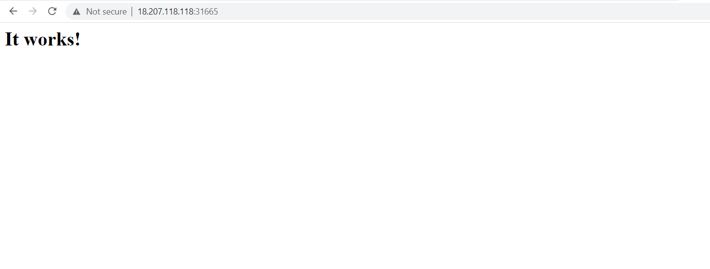
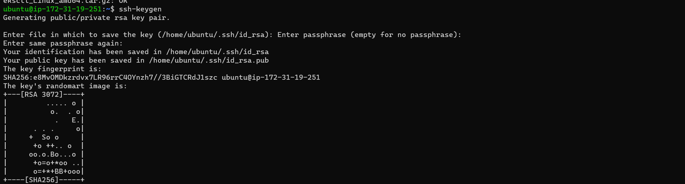
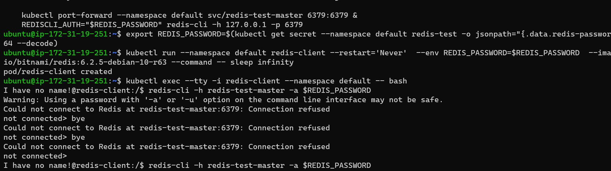
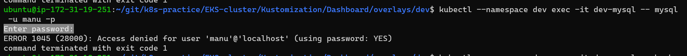
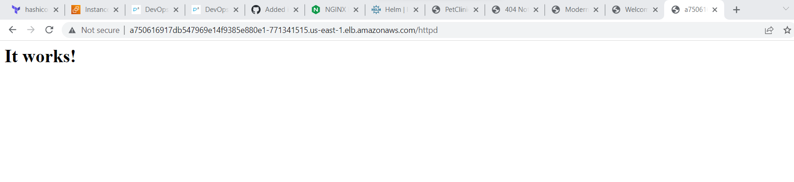
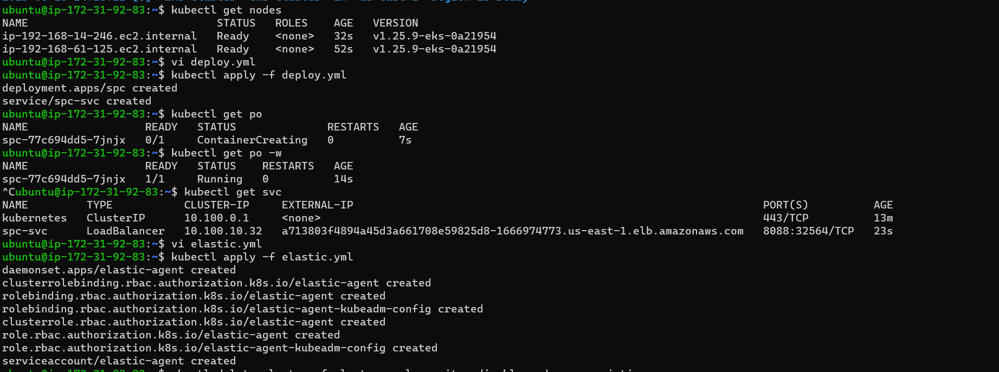

## Date:25/04/2023
## Kubernetes (K8s)
* The shortform of k8s is came from the charachters between the kubernetes of (K-s)
## Definition of kubernetes
* Kubernetes is a portable, extensible, open source platform for managing containerized workloads and services, that facilitates both declarative configuration and automation. It has a large, rapidly growing ecosystem. Kubernetes services, support, and tools are widely available.
* Kubernetes lets you create, deploy, manage, and scale application containers across one or more host clusters.
## Need for K8s
  ## High Availability (HA):
* When we run our applications in docker container and if the container fails, we need to manually start the container.
* If the node i.e. the machine fails all the containers running on the machine should be re-created on other machine.
* K8s can do both of the above.
## Autoscaling
* Containers don’t scale on their own.
* Scaling is of two types
   * Vertical Scaling
   * Horizontal Scaling
* K8s can do both horizontal and vertical scaling of containers
Zero-Down time Deployments
* K8s can handle deployments with near zero-down time deployments
* K8s can handle rollout (new version) and roll back (undo new version => previous version)
* K8s is described as `"Production grade Container management"`.
## Installation of Kubernetes(k8s)
*  Single Node Installations
    * minikube
    * kind
* On-prem installations
    * kube-admin
* k8s as a Service
    * AKS
    * EKS
    * GKE
* Clients
    * kubectl
    * any rest based client
## IMP-k8s terms
   * **Distributed System:**Also known as distributed computing and distributed databases, a distributed system is a collection of independent components located on different machines that share messages with each other in order to achieve common goals.
   * **Node:**A Node is a worker machine in Kubernetes and may be either a virtual or a physical machine, depending on the cluster. Each Node is managed by the control plane. A Node can have multiple pods, and the Kubernetes control plane automatically handles scheduling the pods across the Nodes in the cluster.
   * A node is a basic unit of a data structure, such as a linked list or tree data structure. Nodes contain data and also may link to other nodes. Links between nodes are often implemented by pointers.
   * **Cluster:**A Kubernetes cluster is a set of nodes that run containerized applications. Containerizing applications packages an app with its dependences and some necessary services. They are more lightweight and flexible than virtual machines.
   * **State:**There are three possible container states: Waiting , Running , and Terminated . To check the state of a Pod's containers, you can use kubectl describe pod <name-of-pod> . The output shows the state for each container within that Pod.
   * **Stateful Applications:**Stateful applications save data to persistent disk storage for use by the server, by clients, and by other applications. An example of a stateful application is a database or key-value store to which data is saved and retrieved by other applications.
   ***Stateless application:** A stateless application is one which depends on no persistent storage. The only thing your cluster is responsible for is the code, and other static content, being hosted on it. That's it, no changing databases, no writes and no left over files when the pod is deleted.
   * **Monolith:**A monolithic application is constructed as one unit which means it's composed all in one piece. The Monolithic application describes a one-tiered software application within which different components combined into one program from a single platform.
   * **Microservices:**A microservice is a software design pattern. It's something developers get excited about. They are related, but do not require each other. You can have a monolith deployed as a container, or you can have an unrestricted, non-containerized microservice.
   * **Desired State:**A desired state is defined by configuration files made up of manifests, which are JSON or YAML files that declare the type of application to run and how many replicas are required to run a healthy system. The cluster's desired state is defined with the Kubernetes API(application programming interface).
   * **Declarative vs Imperative:**Imperative configuration involves creating Kubernetes resources directly at the command line against a Kubernetes cluster. Declarative configuration defines resources within manifest files and then applies those definitions to the cluster.
   *** Pet Vs Cattle:**Servers in on-premises data centers are generally viewed as “pets”, whereas servers in the cloud are considered “cattle”. Pets are indispensable servers where you can make configuration changes should problems arise While, Cattle are servers that can be deleted and rebuilt from scratch in case of failures.
## Kube-admin Installation
* Initially k8s used docker as a main container platform and docker used to get special treatment, from k8s 1.24 special treatment is stopped.
* k8s is designed to run any container technology, for this k8s expects container technology to follow k8s interfaces.
* Before install kubernetes we need to install CRI-Dockerd refer here url@https://github.com/Mirantis/cri-dockerd it is only for k8s after 1.24 verions.
## Prerequisets:
* Create 2 or 3 virtual machines with minimum of 2vCPUS and 4GB RAM
* 
* Installation method (kubeadm) which is something we will be using in on-premises k8s.
* Install docker in all the nodes.
* ` curl -fsSL https://get.docker.com -o get-docker.sh`
* `sh get-docker.sh`
* `sudo usermod -aG docker ubuntu` exit and relogin
* 
* 
* Install CRI-DOCKER in all the nodes, run the commands as root user.
```bash
# Run these commands as root
###Install GO###
wget https://dl.google.com/go/go1.21.0.linux-amd64.tar.gz
rm -rf /usr/local/go && tar -C /usr/local -xzf go1.21.0.linux-amd64.tar.gz
export PATH=$PATH:/usr/local/go/bin
go version
# wget https://storage.googleapis.com/golang/getgo/installer_linux
# chmod +x ./installer_linux
# ./installer_linux
# source ~/.bash_profile

git clone https://github.com/Mirantis/cri-dockerd.git
cd cri-dockerd
mkdir bin
go build -o bin/cri-dockerd
mkdir -p /usr/local/bin
install -o root -g root -m 0755 bin/cri-dockerd /usr/local/bin/cri-dockerd
cp -a packaging/systemd/* /etc/systemd/system
sed -i -e 's,/usr/bin/cri-dockerd,/usr/local/bin/cri-dockerd,' /etc/systemd/system/cri-docker.service
systemctl daemon-reload
systemctl enable cri-docker.service
systemctl enable --now cri-docker.socket
```


* Refer here for commands to install kubeadm,kubctl,kubelet url@https://kubernetes.io/docs/setup/production-environment/tools/kubeadm/install-kubeadm/
* Run these commands as root user `sudo apt-get update
* sudo apt-get install -y apt-transport-https ca-certificates curl`
* `sudo curl -fsSLo /etc/apt/keyrings/kubernetes-archive-keyring.gpg https://dl.k8s.io/apt/doc/apt-key.gpg`
* `echo "deb [signed-by=/etc/apt/keyrings/kubernetes-archive-keyring.gpg] https://apt.kubernetes.io/ kubernetes-xenial main" | sudo tee /etc/apt/sources.list.d/kubernetes.list`
* `sudo apt-get update
sudo apt-get install -y kubelet kubeadm kubectl
sudo apt-mark hold kubelet kubeadm kubectl`

* To configure the master node we have to follow below commands and wherever we apply these commands that is considered to be as a master node of kubeadm `kubeadm --help`,`kubeadm init --help`
* To configure kubeadm we have to take network policy as flannel that is "10.244.0.0/16" refer here url@https://github.com/flannel-io/flannel"
* ` kubeadm init --pod-network-cidr "10.244.0.0/16" --cri-socket "unix:///var/run/cri-dockerd.sock"` output of after applying the command
* 
* 
* To configure we have to follow above commands as regular user so you can exit as root user.
* To setup configure run this command to install flannel `kubectl apply -f https://github.com/flannel-io/flannel/releases/latest/download/kube-flannel.yml`
* 
* To attache the nodes to the master run this command by providing CRI-DOCKER in node as a root user `kubeadm join 172.31.85.229:6443 --token bq3k8r.gq6fdcgdaa3oqelt \
        --cri-socket "unix:///var/run/cri-dockerd.sock" \
        --discovery-token-ca-cert-hash sha256:659c7d1ad0262f54bcaa2be1610b251cc064345236d8342a39c3eae0e2ef1617`

* In master node run `kubectl get nodes -w`
* 
## Kubernetes Objects
* Every thing in k8s is an object.
* Every object has a spec and status
* spec: specification (what we have asked)
* status: (what was created)
## Resources in manifest
* To define a resource in a manifest file we create a yaml file with following structure
  * apiVersion: 
  * kind:
  * metadata:
  * spec:
## Kubernetes Objects
* Kubernetes objects are persistent entities in the Kubernetes system. Kubernetes uses these entities to represent the state of your cluster. Specifically, they can describe:
  * What containerized applications are running (and on which nodes)
  * The resources available to those applications
  * The policies around how those applications behave, such as restart policies, upgrades, and fault-tolerance
* A Kubernetes object is a "record of intent"--once you create the object, the Kubernetes system will constantly work to ensure that object exists. By creating an object, you're effectively telling the Kubernetes system what you want your cluster's workload to look like; this is your cluster's desired state.
## Kubernetes API
* The REST API is the fundamental fabric of Kubernetes. All operations and communications between components, and external user commands are REST API calls that the API Server handles. Consequently, everything in the Kubernetes platform is treated as an API object and has a corresponding entry in the API.
* The core of Kubernetes' control plane is the API server. The API server exposes an HTTP API that lets end users, different parts of your cluster, and external components communicate with one another.
* The Kubernetes API lets you query and manipulate the state of API objects in Kubernetes (for example: Pods, Namespaces, ConfigMaps, and Events).By default, the Kubernetes API server listens on port 6443 on the first non-localhost network interface, protected by TLS.
* Controlling Access to the Kubernetes API

## Pods
* Pods are the smallest deployable units of computing that you can create and manage in Kubernetes.
* A Pod (as in a pod of whales or pea pod) is a group of one or more containers, with shared storage and network resources, and a specification for how to run the containers.
* To create a pod use below commands
  ```
  kubectl apply -f
  kubectl get <api-resource>
  kubectl describe <kind> <name>
  ```
*  To view the complete manifest created by k8s `kubectl get <kind> <name> -o yaml`
## Pod lifecycle
* K8s Pods will have following states
  * **Pending:** The Pod has been accepted by the Kubernetes cluster, but one or more of the containers has not been set up and made ready to run. This includes time a Pod spends waiting to be scheduled as well as the time spent downloading container images over the network.
  * **Running:** The Pod has been bound to a node, and all of the containers have been created. At least one container is still running, or is in the process of starting or restarting.
  * **Succeded:** All containers in the Pod have terminated in success, and will not be restarted.
  * **Failed:** All containers in the Pod have terminated, and at least one container has terminated in failure. That is, the container either exited with non-zero status or was terminated by the system.
  * **Unknown:** For some reason the state of the Pod could not be obtained. This phase typically occurs due to an error in communicating with the node where the Pod should be running.
## Container States in k8s pod
  * **Waiting:** If a container is not in either the Running or Terminated state, it is Waiting. A container in the Waiting state is still running the operations it requires in order to complete start up: for example, pulling the container image from a container image registry, or applying Secret data. When you use kubectl to query a Pod with a container that is Waiting, you also see a Reason field to summarize why the container is in that state.
  * **Running:** The Running status indicates that a container is executing without issues. If there was a postStart hook configured, it has already executed and finished. When you use kubectl to query a Pod with a container that is Running, you also see information about when the container entered the Running state.
  * **Terminated:**
## What is a Kubernetes Deployment Strategy?
* When deploying your applications to a K8s cluster, your chosen deployment strategy will determine how those applications are updated to a newer version from an older one. Some strategies will involve downtime, some will introduce testing concepts and enable user analysis.
* There are two basic commonly used K8s deployment strategies we will look at in this post:
    # Recreating Deployments
      * Recreating deployment terminates all the pods and replaces them with the new version. This can be useful in situations where an old and new version of the application cannot run at the same time. The amount of downtime incurred using this strategy will depend on how long the application takes to shut down and start back up. The application state is entirely renewed since they are completely replaced.
      * example: 
      ```yaml
      spec:
        replicas: 10
        strategy:
          type: Recreate
      ```
    # Rolling Deployments
      * Rolling deployments are the default K8S offering designed to reduce downtime to the cluster. A rolling deployment replaces pods running the old version of the application with the new version without downtime.
      * To achieve this, Readiness probes are used:
      * Readiness probes monitor when the application becomes available. If the probes fail, no traffic will be sent to the pod.These   are used when an app needs to perform certain initialization steps before it becomes ready. An application may also become overloaded with traffic and cause the probe to fail, preventing more traffic from being sent to it and allowing it to recover.
      * Once the readiness probe detects the new version of the application is available, the old version of the application is removed. If there is a problem, the rollout can be stopped and rolled back to the previous version, avoiding downtime across the entire cluster. 
      * A rolling deployment is triggered when something in the pod spec is changed, such as when the image, environment, or label of a pod is updated. A pod image can be updated using the command kubectl set image.
      * The spec: -> strategy: section of the manifest file can be used to refine the deployment by making use of two optional parameters — maxSurge and maxUnavailable. Both can be specified using a percentage or absolute number. A percentage figure should be used when Horizontal Pod Autoscaling is used.
      * **MaxSurge** specifies the maximum number of pods the Deployment is allowed to create at one time.
      * **MaxUnavailable** specifies the maximum number of pods that are allowed to be unavailable during the rollout.
      * exmple: In this 3 being created at any one time, allowing for 1 to be unavailable during the rollout.
      ```yaml
      spec:
        replicas: 10
        strategy:
        type: RollingUpdate
        rollingUpdate:
          maxSurge: 3
          maxUnavailable: 1
      ```
    # Blue/Green Deployments
      * A Blue/Green deployment involves deploying the new application version (green) alongside the old one (blue). A load balancer in the form of the service selector object is used to direct the traffic to the new application (green) instead of the old one when it has been tested and verified. Blue/Green deployments can prove costly as twice the amount of application resources need to be stood up during the deployment period.
      * To enable this, we set up a service sitting in front of the deployments. For example, the service selector section of the manifest file for the blue deployment for an app called web-app with v1.0.0 could look like the below:
      ```yaml
        kind: Service
        metadata:
        name: web-app-01
        labels:
          app: web-app
        selector:
          app: web-app
          version: v1.0.0
          # And the deployment for the blue web app:

        kind: Deployment
        metadata:
          name: web-app-01
        spec:
          template:
                metadata:
                  labels:
                    app: web-app
                    version: "v1.0.0"
            # When we want to direct traffic to the new (green) version of the app, we update the manifest to point to the new version, v2.0.0.

        kind: Service
        metadata:
        name: web-app-02
        labels:
          app: web-app
        selector:
          app: web-app
          version: v2.0.0
         # The deployment for the green app:

        kind: Deployment
        metadata:
          name: web-app-02
        spec:
          template:
                metadata:
                  labels:
                    app: web-app
                    version: "v2.0.0"
        ```
    # Canary Deployments
      * A Canary deployment can be used to let a subset of the users test a new version of the application or when you are not fully confident about the new version’s functionality. This involves deploying a new version of the application alongside the old one, with the old version of the application serving most users and the newer version serving a small pool of test users. The new deployment is rolled out to more users if it is successful.
      * For example, in a K8s cluster with 100 running pods, 95 could be running v1.0.0 of the application, with 5 running the new v2.0.0 of the application. 95% of the users will be routed to the old version, and 5% will be routed to the new version. For this, we use 2 deployments side-by-side that can be scaled separately.
      * The spec section of the old application manifest would look like the following:
      ```yaml
        spec:
          replicas: 95
        # And the new application manifest:
        spec:
          replicas: 5
      ```
    #  A/B Deployments
      * Similar to a Canary deployment, using an A/B deployment, you can target a given subsection of users based on some target parameters (usually the HTTP headers or a cookie), as well as distribute traffic amongst versions based on weight. This technique is widely used to test the conversion of a given feature, and then the version that converts the most is rolled out.
      * This approach is usually taken based on data collected on user behavior and can be used to make better business decisions. Users are usually uninformed of the new features during the A/B testing period, so true testing can be done, and experiences between the users using the old version and those using the new version can be compared. Rollouts can be slower using A/B deployments due to the additional testing period and analysis of the user experience.
      * A/B deployments can be automated using Istio and Flagger, check out the tutorial here for more information on how to set it up.
## Date:26/04/2023

## Day-1 k8s tasks
## 1) Write a Pod Spec for Spring PetClinic and nopCommerce Applications
## Spring-petclinic
* First create kubernetes Pod spec or manifest.
```yaml
---
apiVersion: V1
kind: Pod
metadata:
  name: spc1-app
spec:
  containers:
    - name: spc
      image: manugatla/spring-petclinic
      ports:
        - containerPort: 8080
```
## Nopcommerce
* First create kubernetes Pod spec or manifest.
```yaml
---
apiVersion: V1
kind: Pod
metadata:
  name: nop-app
spec:
  containers:
    - name: spc
      image: manugatla/nopcommerce
      ports:
        - containerPort: 8080
```
## 2) Execute the kubectl commands:
## For Spring-petclinic
* To create a Pod we have to use command as `kubectl apply -f springpetclinic.yaml`
* To know the pod is created or not, run this command `kubectl get pods/po`
* To describe the Pod, run this command `kubectl describe pod spc1-app ==> <name of pod>`

## For Nopcommerce
* To create a Pod we have to use command as `kubectl apply -f nopcommerce.yaml`
* To know the pod is created or not, run this command `kubectl get pods/po`
* To describe the Pod, run this command `kubectl describe pod nop-app ==> <name of pod>`


## Date:27/04/2023

## Day-2 k8s tasks

# Explain Kubernetes architecture
* Kubernetes is an architecture that offers a loosely coupled mechanism for service discovery across a cluster. A Kubernetes cluster has one or more control planes, and one or more compute nodes.
* Environments running Kubernetes consist of the following key components:
* Control plane:It manges the k8s clusters and Workloads and it has componetns like API server,Schedular and control manger
  * API Server:It servers as front end for k8s to communicate with control plane componets and worker nodes and handling external and internal request.
  * Schedular:This component is responsible for scheduling pods on specific nodes according to automated workflows.
  * Control manger:The Kubernetes controller manager is a control loop that monitors and regulates the state of a Kubernetes cluster.
  * etcd:It is component in control plane which stores the data of cluster state and configuration.
  * cloud-controller-manager:This component can embed cloud-specific control logic - for example, it can access the cloud provider’s load balancer service.
* Worker nodes:
  * Nodes: Nodes are physical or virtual machines that can run pods as part of a Kubernetes cluster. A cluster can scale up to 5000 nodes. 
  * Pods: A pod serves as a single application instance, and is considered the smallest unit in the object model of Kubernetes.
  * kubelet: Each node contains a kubelet, which is a small application that can communicate with the Kubernetes control plane.
  * kube-proxy:It handles all network communications outside and inside the cluster, forwarding traffic or replying on the packet filtering layer of the operating system.

# Setup k8s on single node using minikube and kind
# Minikube Installation
* Requirements for installation of Minikube
  * 2 CPUs or more.
  * 2GB of free memory.
  * 20GB of free disk space.
  * Internet connection.
  * Container or virtual machine manager, such as: Docker
# Steps
* Install Docker 


* Install Minikube Refer here url@https://minikube.sigs.k8s.io/docs/start/ 
* Run below commands to install Minikube
* `curl -LO https://storage.googleapis.com/minikube/releases/latest/minikube-linux-amd64`
* `sudo install minikube-linux-amd64 /usr/local/bin/minikube`
* Start your cluster use below command
* `minikube start`

* To Interact with your cluster use below commands
* If you already have kubectl installed, you can now use it to access your shiny new cluster use this command `kubectl get po -A`
* If not use `minikube kubectl -- get po -A` to easy way of using this command you need to use `alias kubectl="minikube kubectl --"`

* some services such as the storage-provisioner, may not yet be in a Running state. This is a normal condition during cluster bring-up, and will resolve itself momentarily. For additional insight into your cluster state, minikube bundles the Kubernetes Dashboard, allowing you to get easily acclimated to your new environment:
* `minikube dashboard` to exit from Dashboard use `CTRL+C`
* To Deploy applications
* Create a Spring-petclinic application deployment and expose it on port 8080.
* `kubectl create deployment spc-minikube --image=manugatla/spring-petclinic`
* `kubectl expose deployment spc-minikube --type=NodePort --port=8080`
* `kubectl get services spc-minikube`
* To Port forwarding use command `kubectl port-forward --address "0.0.0.0" service/spc-minikube 7081:8080` then to access application ` http://localhost:7081/.` localhost => Public ip


# Kind Installation
* Requirements for installation of Minikube
  * 2 CPUs or more.
  * 2GB of free memory.
  * 20GB of free disk space.
  * Internet connection.
  * Container or virtual machine manager, such as: Docker
  * 6GB of RAM dedicated to the virtual machine (VM) running the Docker engine. 
# Steps
* Install Docker 
* To install kind on linux ubuntu use below commands and refer here for more details url@https://kind.sigs.k8s.io/docs/user/quick-start/
* `curl -Lo ./kind https://kind.sigs.k8s.io/dl/v0.18.0/kind-linux-amd64`
* `chmod +x ./kind`
* `sudo mv ./kind /usr/local/bin/kind`

* To create cluster in Kind use `kind create cluster`

* To create Pods in kind use below commands
* First create a manifest file then apply commands 
```yaml
apiVersion: v1
kind: Pod
metadata:
  name: spc-app
spec:
  containers:
    - name: spc
      image: manugatla/spring-petclinic:latest
      ports:
        - containerPort: 8080
```
* `kubectl apply -f <spc.yaml>
* To see the pods
* `kubect get pods`

* 
# Run the Spring Pet Clinic
# Deployed application in Minikube
* Create a Spring-petclinic application deployment and expose it on port 8080.
* `kubectl create deployment spc-minikube --image=manugatla/spring-petclinic`
* `kubectl expose deployment spc-minikube --type=NodePort --port=8080`
* `kubectl get services spc-minikube`
* To Port forwarding use command `kubectl port-forward --address "0.0.0.0" service/spc-minikube 7081:8080` 
* To access application` http://localhost:7081/.` localhost => Public ip


## Date:28/04/2023

## Day-3 k8s activities

## K8s manifest by using api-service "restartpolicy"
* The spec of a Pod has a restartPolicy field with possible values Always, OnFailure, and Never. The default value is Always.
* The restartPolicy applies to all containers in the Pod. restartPolicy only refers to restarts of the containers by the kubelet on the same node. After containers in a Pod exit, the kubelet restarts them with an exponential back-off delay (10s, 20s, 40s, …), that is capped at five minutes.
## Restart always
```yaml
apiVersion: v1
kind: Pod
metadata:
  name: always-restart
spec:
  restartPolicy: Always
  containers:
    - name: always
      image: manugatla/spring-petclinic
      ports:
        - containerPort: 8080
      command: ["sleep","10s"]
```
commands to execute
* `kubectl apply -f restartalways.yaml`
* To get pods use `kubectl get po -w`


## Restart Onfailure
```yaml
# Restart Onfailure code -failure
---
apiVersion: v1
kind: Pod
metadata:
  name: onfailure-restart
spec:
  restartPolicy: OnFailure
  containers:
    - name: failure
      image: manugatla/spring-petclinic
      ports:
        - containerPort: 8080
      command: ["sleep","1sm"]
```
commands to execute
* `kubectl apply -f restartonfailure.yaml`
* To get pods use `kubectl get po -w`

```yaml
# Restart Onfailure code -success
---
apiVersion: v1
kind: Pod
metadata:
  name: onfailure-restart-1
spec:
  restartPolicy: OnFailure
  containers: 
    - name: success
      image: manugatla/spring-petclinic
      ports:
        - containerPort: 8080
      command: ["sleep","10s"]
```
commands to execute
* `kubectl apply -f restartonfailure1.yaml`
* To get pods use `kubectl get po -w`

## Restart never
```yaml
---
apiVersion: v1
kind: Pod
metadata:
  name: never-restart
spec:
  restartPolicy: Never
  containers:
    - name: always
      image: manugatla/spring-petclinic
      ports:
        - containerPort: 8080
      command: ["sleep","10s"]
```
commands to execute
* `kubectl apply -f restartnever.yaml`
* To get pods use `kubectl get po -w`

## Jobs
* A Job creates one or more Pods and will continue to retry execution of the Pods until a specified number of them successfully terminate. As pods successfully complete, the Job tracks the successful completions.
```yaml
apiVersion: batch/v1
kind: Job
metadata:
  name: job-intro
spec:
  backoffLimit: 3
  template:
    metadata:
      name: spc
    spec:
      restartPolicy: Never
      containers:
        - name: alpine
          image: alpine
          ports:
            - containerPort: 8080
          command:
            - sleep
            - 10s
```
commands to execute
* `kubectl apply -f jobs.yaml`
* To get jobs use `kubectl get jobs -w`
* To get pods use `kubectl get po -w`

## Cronjob
* CronJob is meant for performing regular scheduled actions such as backups, report generation, and so on. 
```yaml
---
apiVersion: batch/v1
kind: CronJob
metadata: 
  name: cornjob
spec:
  schedule: '* * * * *'
  jobTemplate:
    metadata:
      name: create data
    spec:
      backoffLimit: 2
      template:
        metadata:
          name: to create containers
        spec:
          restartPolicy: OnFailure
          containers:
            - name: jenkins
              image: jenkins/jenkins:jdk11
              ports:
                - containerPort: 8080
              command: ["sleep","10s"]
            - name: nginx
              image: nginx:1.24
              ports:
                - containerPort: 80
              command: ["sleep","10s"]
```
commands to execute
* `kubectl apply -f cornjobs.yaml`
* To get cronjobs use `kubectl get cornjobs` or `kubectl get cornjobs.batch`

* To get pods use `kubectl get jobs -w`

## Replicaset
* A ReplicaSet's purpose is to maintain a stable set of replica Pods running at any given time. As such, it is often used to guarantee the availability of a specified number of identical Pods.
```yaml
---
apiVersion: apps/v1
kind: ReplicaSet
metadata:
  name: replicaset
spec:
  minReadySeconds: 1
  replicas: 3
  selector: 
    matchLabels:
      app: jenkins
  template:
    metadata:
      name: jenkins-pod
      labels:
        app: jenkins
    spec:
      restartPolicy: OnFailure
      containers:
        - name: jenkins
          image: jenkins/jenkins:jdk11
          ports:
            - containerPort: 8080
          command: ["sleep","5s"]
```
commands to execute
* `kubectl apply -f jenkins-rs.yaml`
* To get replicasets use `kubectl get rs -w`
* To get pods use `kubectl get po -w`


## Date:05/05/2023
* Create a MySQL pod with Stateful Set with 1 replica
```yaml
apiVersion: apps/v1
kind: StatefulSet
metadata:
  name: mysqldb
spec:
  minReadySeconds: 1
  serviceName: mysql
  replicas: 1
  selector:
    matchLabels:
      db: mysql
  template:
    metadata:
      name: mysqlpod
      labels:
        db: mysql
    spec:
      containers:
        - name: mysql
          image: mysql:8.0
          ports:
            - containerPort: 3306
          env:
            - name: MYSQL_ROOT_PASSWORD
              value: manuroot
            - name: MYSQL_USER
              value: gmanohar
            - name: MYSQL_PASSWORD
              value: manu1234
            - name: MYSQL_DATABASE
              value: students
          volumeMounts:
            - name: sqlvolume
              mountPath: /var/lib/mysql
      volumes:
        - name: sqlvolume
          emptyDir:
              sizeLimit: 100Mi
---
apiVersion: v1
kind: Service
metadata:
  name: mysql
spec:
  type: ClusterIP
  selector:
    db: mysql
  ports:
    - port: 3300
      protocol: TCP
      targetPort: 3306
```

* Create a nopCommerce deployment with 1 replica
```yaml
apiVersion: apps/v1
kind: Deployment
metadata:
  name: nopdeploy
  labels:
    app: nop
spec:
  minReadySeconds: 1
  replicas: 1
  selector:
    matchLabels:
      app: nop
  strategy:
    type: RollingUpdate
  template:
    metadata:
      name: noppod
      labels:
        app: nop
    spec:
      containers:
        - name: nopcommerce
          image: manugatla/nopcommerce
          ports:
            - containerPort: 5000
          env:
            - name: MYSQL_SERVER
              value: mysql
---
apiVersion: v1
kind: Service
metadata:
  name: nopsvc
spec:
  type: LoadBalancer
  selector:
    app: nop
  ports:
    - port: 3000
      protocol: TCP
      targetPort: 5000  
```

* Create a Headless Service to interact with nopCommerce with MySQL 
```yaml
apiVersion: v1
kind: Service
metadata:
  name: headless
spec:
  type: ClusterIP
  clusterIP: None 
  ports:
    - port: 80
      protocol: TCP
      targetPort: 5000
  selector:
    app: nop
    db: mysql
```
* Create a Load Balancer to expose the nopCommerce to External World
 
 
* Try to draw the Architecture Diagram for the above by using Draw.io Tool.


## Date: 09/05/2023
## 1.Create a Kubernetes cluster using kubeadm
* To install kubeadm cluster create `2 or 3 t2medium` EC2 instances in AWS cloud 
* Created shell script to install kubeadm
```bash
#!/bin/bash
apt-get update
curl -fsSL https://get.docker.com -o get-docker.sh
sh get-docker.sh
sudo usermod -aG docker ubuntu 
wget https://storage.googleapis.com/golang/getgo/installer_linux
chmod +x ./installer_linux
./installer_linux
source ~/.bash_profile
git clone https://github.com/Mirantis/cri-dockerd.git
cd cri-dockerd
mkdir bin
go build -o bin/cri-dockerd
mkdir -p /usr/local/bin
install -o root -g root -m 0755 bin/cri-dockerd /usr/local/bin/cri-dockerd
cp -a packaging/systemd/* /etc/systemd/system
sed -i -e 's,/usr/bin/cri-dockerd,/usr/local/bin/cri-dockerd,' /etc/systemd/system/cri-docker.service
systemctl daemon-reload
systemctl enable cri-docker.service
systemctl enable --now cri-docker.socket
cd ~
sudo apt-get update
sudo apt-get install -y apt-transport-https ca-certificates curl
sudo curl -fsSLo /etc/apt/keyrings/kubernetes-archive-keyring.gpg https://packages.cloud.google.com/apt/doc/apt-key.gpg
echo "deb [signed-by=/etc/apt/keyrings/kubernetes-archive-keyring.gpg] https://apt.kubernetes.io/ kubernetes-xenial main" | sudo tee /etc/apt/sources.list.d/kubernetes.list
sudo apt-get update
sudo apt-get install -y kubelet kubeadm kubectl
sudo apt-mark hold kubelet kubeadm kubectl
```
* EXit and Re-login into machine.
* To create cluster use command in master node `kubeadm init --pod-network-cidr "10.244.0.0/16" --cri-socket "unix:///var/run/cri-dockerd.sock"`
* 
* 
* To configure we have to follow above commands as regular user so you can exit as root user.
* To setup configure run this command to install flannel `kubectl apply -f https://github.com/flannel-io/flannel/releases/latest/download/kube-flannel.yml`
* 
* To attache the nodes to the master run this command by providing CRI-DOCKER in node as a root user `kubeadm join 172.31.85.229:6443 --token bq3k8r.gq6fdcgdaa3oqelt \
        --cri-socket "unix:///var/run/cri-dockerd.sock" \
        --discovery-token-ca-cert-hash sha256:659c7d1ad0262f54bcaa2be1610b251cc064345236d8342a39c3eae0e2ef1617`

* In master node run `kubectl get nodes -w`
* 

## 2.Deploy any application using kubectl
* Deployed Game-of-life by using Deployment in `microk8s cluster`
* Game-of-life yaml file
```yaml
apiVersion: apps/v1
kind: Deployment
metadata:
  name: game-of-life
spec:
  minReadySeconds: 1
  replicas: 3
  selector:
    matchLabels:
      app: gol
  strategy:
    type: RollingUpdate
    rollingUpdate:
      maxSurge: 25%
      maxUnavailable: 25%
  template:
    metadata:
      name: gol-pod
      labels:
        app: gol
    spec:
      containers:
        - name: gol-cont
          image: manugatla/gameoflife
          ports:
            - containerPort: 8080
---
apiVersion: v1
kind: Service
metadata: 
  name: gol-svc
spec:
  type: LoadBalancer
  selector:
    app: gol
  ports:
    - port: 8081
      protocol: TCP
      targetPort: 8080 
```
* To Create Deployement `microk8s kubectl apply -f gol.yaml

* To get the pods `microk8s kubectl get po -w`

## 3.Backup Kubernetes I.e backup etcd
* To take etcd backup install etcd-client `sudo apt install etcd-client`

* You can also get the above details by describing the etcd pod running in the kube-system namespace. 
`kubectl get po -n kube-system` && `kubectl describe pod etcd-master-node -n kube-system`


* Take an etcd snapshot backup using the following command.
```
ETCDCTL_API=3 etcdctl \
  --endpoints=https://127.0.0.1:2379 \
  --cacert=/etc/kubernetes/pki/etcd/ca.crt \
  --cert=/etc/kubernetes/pki/etcd/server.crt \
  --key=/etc/kubernetes/pki/etcd/server.key \
  snapshot save /etcd.db
```


* To check the status of ETCD snapshot.db

* Also, you can verify the snapshot using the following command.
`ETCDCTL_API=3 etcdctl --write-out=table snapshot status /etcd.db`

* Here is the command to restore etcd.`etcdutl snapshot restore snapshot.db --data-dir spc.yaml`&&`ETCDCTL_API=3 etcdctl snapshot restore /etcd.db [optional]`


## 4.List out all the pod’s running in kube system namespace
* To listout pods running in kube-system namespace `kubectl get pods --namespace=kube-system`

## 5.Write down all the steps required to make Kubernetes highly available
* For worker node high availability, you need to run multiple worker nodes that is required for your applications. When there is a pod scaling activity or a node failure there should be enough capacity on other worker nodes for the pods to get scheduled.
* Scalability is the capacity of a system to scale up or down in performance and cost in response to changes in application and system processing demands.
* Crucial components like the API server and controller manager are replicated on several masters (typically two or more masters) in a Kubernetes High Availability system. If one of the masters fails, the remaining masters keep the cluster functioning.
* Kubernetes High Availability ensures that Kubernetes and its supporting components have no single point of failure.
* A single master cluster is vulnerable to failure, but a multi-master cluster uses many master nodes, each having access to the same worker nodes.
* The Kubernetes control plane and its nodes must be distributed over many zones to provide high availability. Single-zone and multi-zonal node pools are available in GKE. Distribute your workload over many compute zones in a region using multi-zonal node pools, distributing nodes equally across zones to create a highly available application.

## 6.Do a rolling update and roll back.
* Create a Deployment file with rolling update
```yaml
---
apiVersion: apps/v1
kind: Deployment
metadata:
  name: nginx
  labels:
    app: nginx
  annotations:
    kubernetes.io/change-cause: "changed to nginx"
spec:
  minReadySeconds: 1
  replicas: 1
  selector:
    matchLabels:
      app: nginx
  strategy:
    type: RollingUpdate
    rollingUpdate:
      maxSurge: 25%
      maxUnavailable: 25%
  template:
    metadata:
      name: nginx
      labels:
        app: nginx
    spec:
      containers:
        - name: nginx
          image: nginx
          ports:
            - containerPort: 80
---
## service file for nginx
apiVersion: v1
kind: Service
metadata:
  name: nginx
spec:
  selector:
    app: nginx
  type: LoadBalancer
  ports:
    - port: 80
      protocol: TCP
      targetPort: 80
```
* Create the deployment by usimg below commands
* `kubectl apply -f rollout.yaml`


* Change the image to nginx and apply the changes 
* to check the history of rollout `kubectl rollout history deployment/nginx`


## 7.Ensure usage of secret in MySQL and configmaps
* A Kubernetes ConfigMap is an API object that allows you to store data as key-value pairs.
* Create a configmap manifest yaml file
```yaml
---
## config-map 
apiVersion: v1
kind: ConfigMap
metadata:
  name: mysql-config
data:
  MYSQL_ROOT_PASSWORD: manuroot
  MYSQL_USER: manu
  MYSQL_PASSWORD: gatlamano
  MYSQL_DATABASE: students
```
* Create mysql pod manifest yaml file
```yaml
## mysql-pod
apiVersion: apps/v1
kind: Deployment
metadata:
  name: mysql
  labels:
    app: mysql
spec:
  minReadySeconds: 1
  replicas: 1
  selector:
    matchLabels:
      app: mysql
  template:
    metadata:
      name: mysqlpod
      labels:
        app: mysql
    spec:
      containers:
        - name: mysql
          image: mysql:8.0
          ports:
          - containerPort: 3306
          envFrom:
            - configMapRef:
                name: mysql-config
---
## service file for mysql
apiVersion: v1
kind: Service
metadata:
  name: mysql
spec:
  selector:
    app: mysql
  type: LoadBalancer
  ports:
    - port: 3306
      protocol: TCP
      targetPort: 3306
```
* To check the configmap values get inside pod using `kubectl exec -it mysql-85d457d6df-kw2s8 -- /bin/bash `
* To view environmental variables type `printenv`

```yaml
## secret file
apiVersion: v1
kind: Secret
metadata:
  name: sql-secret
data:
  MYSQL_ROOT_PASSWORD: bWFudXJvb3Q=
  MYSQL_USER: bWFudQ==
  MYSQL_PASSWORD: Z2F0bGFtYW5v
  MYSQL_DATABASE: c3R1ZGVudHM=
```
* To create secret use this command `kubectl apply -f secret.yaml`
* To desccribe the secret `kubectl describe secret sql-secret`


## 8.Create a nop commerce deployment with MySQL statefulset and nop deployment
## mysql-manifest file
```yaml
apiVersion: v1
kind: PersistentVolumeClaim
metadata:
  name: mysql-pvc1
spec:
  accessModes:
    - ReadWriteOnce
  storageClassName: managed
  resources:
    requests:
      storage: 1Gi
---
apiVersion: apps/v1
kind: StatefulSet
metadata:
  name: mysqldb
spec:
  minReadySeconds: 1
  serviceName: mysql
  replicas: 1
  selector:
    matchLabels:
      db: mysql
  template:
    metadata:
      name: mysqlpod
      labels:
        db: mysql
    spec:
      containers:
        - name: mysql
          image: mysql:8.0
          ports:
            - containerPort: 3306
          env:
            - name: MYSQL_ROOT_PASSWORD
              value: manuroot
            - name: MYSQL_USER
              value: gmanohar
            - name: MYSQL_PASSWORD 
              value: manu1234
            - name: MYSQL_DATABASE 
              value: students
          volumeMounts:
            - name: mysql-pvc
              mountPath: /var/lib/mysql
      volumes:
        - name: mysql-pvc
          persistentVolumeClaim:
            claimName: mysql-pvc1
            readOnly: false
  # volumeClaimTemplates:
  #   - metadata:
  #       name: sqlvolume
  #     spec:
  #       accessModes:
  #         - ReadWriteOnce
  #       selector:
  #         matchLabels:
  #           db: mysql
  #       storageClassName: managed
  #       resources:
  #         requests:
  #           storage: 1Gi      
---
apiVersion: v1
kind: Service
metadata:
  name: mysql
spec:
  type: ClusterIP
  selector:
    db: mysql
  ports:
    - port: 4500
      protocol: TCP
      targetPort: 3306
```
## nop yaml
```yaml
apiVersion: apps/v1
kind: Deployment
metadata:
  name: nopdeploy
  labels:
    app: nop
spec:
  minReadySeconds: 1
  replicas: 1
  selector:
    matchLabels:
      app: nop
  strategy:
    type: RollingUpdate
  template:
    metadata:
      name: noppod
      labels:
        app: nop
    spec:
      containers:
        - name: nopcommerce
          image: manugatla/nopcommerce
          ports:
            - containerPort: 5000
          env:
            - name: MYSQL_SERVER
              value: mysql
---
apiVersion: v1
kind: Service
metadata:
  name: nopsvc
spec:
  type: LoadBalancer
  selector:
    app: nop
  ports:
    - port: 3000
      protocol: TCP
      targetPort: 5000
```
## Date: 11/05/2023
## Kubernetes tasks
## 1.Create 1 master node and 2 worker nodes – run app on node1 and db on node2 by using
  ## a.Node selector
  * use below commands to see nodes and labels 
  * `kubectl get nodes` 
  * `kubectl get nodes --show-labels`
  
  * To assign the labels to nodes `kubectl label nodes <node-name> <key=value>`
  
  * To Create nop manifest to assign specific node by using nodeselector option
  * `kubectl apply -f nop.yaml` && `kubectl get po -o wide`
  
  * To Create mysql manifest to assign specific node by using nodeselector option
  * `kubectl apply -f sql.yaml` && `kubectl get po -o wide`
  
  ## b.Affinity
  * use below commands to see nodes and labels 
  * `kubectl get nodes` 
  * `kubectl get nodes --show-labels`
  
  * To assign the labels to nodes `kubectl label nodes <node-name> <key=value>`
  
  * To Create mysql manifest to assign specific node by using nodeselector option
  * `kubectl apply -f sql-affinity.yaml` && `kubectl get po -o wide`
  
  * To Create nop manifest to assign specific node by using nodeselector option
  * `kubectl apply -f nop-affinity.yaml` && `kubectl get po -o wide`
  
  ## c.Taints and tolerances 
  * You add a taint to a node using kubectl taint
  * `kubectl taint nodes <node-name> key=value:NoSchedule`
  * To remove the taint added by the command above, you can run:
  * `kubectl taint nodes <node-name> key=value:NoSchedule-`
  
  * You specify a toleration for a pod in the PodSpec.
  * `kubectl apply -f sql-toleration.yaml`
  
  * `kubectl apply -f nop-toleration.yaml`
  
## 2.Create k8s cluster with version 1.25 and run any deployment(nginx/any) and then upgrade cluster to version 1.27  
* Installed kubeadm with 1.25 version and deployed jenkins application
* while upgrading to version from 1.25.5 to 1.27.0 getting error

## Date: 16/05/2023(Kubernetes tasks)
## 1.Installing EKS Cluster using Eksctl 
* First Create an IAM user and Create security credentials(secret key & secret access key)
* Install aws-cli and configure `aws configure`
* Install Kubectl 
* `curl -LO "https://dl.k8s.io/release/$(curl -L -s https://dl.k8s.io/release/stable.txt)/bin/linux/amd64/kubectl"`
* `sudo install -o root -g root -m 0755 kubectl /usr/local/bin/kubectl` & `chmod +x kubectl`
* `kubectl version`

* Install Eksctl
* To download the latest release, run:
```bash
# for ARM systems, set ARCH to: `arm64`, `armv6` or `armv7`
ARCH=amd64
PLATFORM=$(uname -s)_$ARCH

curl -sLO "https://github.com/weaveworks/eksctl/releases/latest/download/eksctl_$PLATFORM.tar.gz"

# (Optional) Verify checksum
curl -sL "https://github.com/weaveworks/eksctl/releases/latest/download/eksctl_checksums.txt" | grep $PLATFORM | sha256sum --check

tar -xzf eksctl_$PLATFORM.tar.gz -C /tmp && rm eksctl_$PLATFORM.tar.gz

sudo mv /tmp/eksctl /usr/local/bin
``` 

To see the version `eksctl version`
* Create a manifest yaml as cluster.yaml 
```yaml
apiVersion: eksctl.io/v1alpha5
kind: ClusterConfig
metadata:
  name: eks-cluster
  region: us-east-1
nodeGroups:
  - name: ng-1
    instanceType: t2.medium
    desiredCapacity: 2
    volumeSize: 20
    ssh:
      allow: true # will use ~/.ssh/id_rsa.pub as the default ssh key
```
* Before applying cluster.yaml generate `ssh-keygen` then apply.

* To see the versions of above

* To create an cluster, run: `eksctl create cluster -f cluster.yaml` 
```yaml
apiVersion: eksctl.io/v1alpha5
kind: ClusterConfig
metadata:
  name: eks-cluster
  region: us-east-1
nodeGroups:
  - name: ng-1
    instanceType: t2.medium
    desiredCapacity: 2
    volumeSize: 20
    ssh:
      allow: true # will use ~/.ssh/id_rsa.pub as the default ssh key
```

* Cluster will be created after 20mins

* To delete cluster, run: `eksctl delete cluster -f cluster.yaml --wait --disable-nodegroup-eviction`

## 2.Installations using helm chart
* First install helm chart in cluster, run:
* `curl -fsSL -o get_helm.sh https://raw.githubusercontent.com/helm/helm/main/scripts/get-helm-3`
* `chmod 700 get_helm.sh`
*  `./get_helm.sh`

  # a. Mysql
  
  
  
  # b. PostgreSql
  
  
  
  # c. mongoDB
  
  # d. Redis cache
  
  
  
## 3. write kostomize file by creating files for 3 environments
* First create Kustomize file as two directories like base and overlays 
  * In bases create main files like deployement.yaml, service.yaml, kustomization.yaml..etc
  * In overlays create multiple environments like `DEV, QA, UAT, PROD` and create kustomization file in each directory.
  # a.dev-environment
  * `kubectl apply -k ./`
  
   
  # b.qa-environment
  * `kubectl apply -k ../qa/`
  
  # c.test-environment
  * `kubectl apply -k ../uat/`
  
# every environment should have their own secrets
* `kubectl apply -k ./`
  
  
  
  
  
## Ingress
* Kubernetes Ingress is an API object that provides routing rules to manage access to the services within a Kubernetes cluster. This typically uses HTTPS and HTTP protocols to facilitate the routing. Ingress is the ideal choice for a production environment.
* In k8s we have 3 major objects which will help in ingress (layer 7 loadbalancing)
  * ingress
  * ingress-controller
  * ingress class
* K8s doesnot have controller for ingress.
* Deploying your services, you attach information that tells Traefik the characteristics of the requests the services can handle.

## Ingress Controller
* Create an a EKS cluster by using eksctl 
* Install helm by run below commands
```
curl -fsSL -o get_helm.sh https://raw.githubusercontent.com/helm/helm/main/scripts/get-helm-3
chmod 700 get_helm.sh
./get_helm.sh
```

* Install ingress controller by he chart by below commands
```
helm repo add nginx-stable https://helm.nginx.com/stable
helm repo update
helm upgrade --install ingress-nginx ingress-nginx \
             --repo https://kubernetes.github.io/ingress-nginx \
             --namespace ingress-nginx --create-namespace
```

* To get the service of ingress controller use coommand given by ingress controller
`kubectl --namespace ingress-nginx get services -o wide -w ingress-nginx-controller`
* To get ingress class of ingress controller
`kubectl get ingressclasses.networking.k8s.io`

* Create deployment, service and ingress manifest files
* create all by run `kubectl apply -f .`

* To access the application in the web copy service type url/service names
 ## code error




## Monitoring EKS cluster by elastic cloud kibana
* Create an a eks cluster 
* login to the elastic cloud and click on obeservability


* Add the kubernetes integration by creating agent policy provided by ELK(kibana) in cluster and deployed an a application



* After installing it listens the agents of cluster added to the agents and it shows the healthy conditions of nodes

* Check the logs of agents by clicking in fleet agents 


* To checkt the metrics of cluster click on overview


* Before accessing of an application

* After accessing of an application

* Inventory of hosts, k8s pods etc,,.


* To Check the logs events


* Created Dashboard visualization


* 

## Deploying application into k8s cluster through jenkins
step -1 crrst