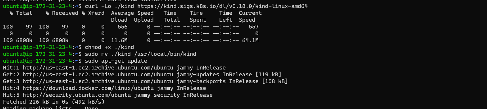

## Date:25/04/2023
## Kubernetes (K8s)
* The shortform of k8s is came from the charachters between the kubernetes of (K-s)
## Definition of kubernetes
* Kubernetes is a portable, extensible, open source platform for managing containerized workloads and services, that facilitates both declarative configuration and automation. It has a large, rapidly growing ecosystem. Kubernetes services, support, and tools are widely available.
* Kubernetes lets you create, deploy, manage, and scale application containers across one or more host clusters.
## Need for K8s
  ## High Availability (HA):
* When we run our applications in docker container and if the container fails, we need to manually start the container.
* If the node i.e. the machine fails all the containers running on the machine should be re-created on other machine.
* K8s can do both of the above.
## Autoscaling
* Containers don’t scale on their own.
* Scaling is of two types
   * Vertical Scaling
   * Horizontal Scaling
* K8s can do both horizontal and vertical scaling of containers
Zero-Down time Deployments
* K8s can handle deployments with near zero-down time deployments
* K8s can handle rollout (new version) and roll back (undo new version => previous version)
* K8s is described as `"Production grade Container management"`.
## Installation of Kubernetes(k8s)
*  Single Node Installations
    * minikube
    * kind
* On-prem installations
    * kube-admin
* k8s as a Service
    * AKS
    * EKS
    * GKE
## Kube-admin Installation
* Initially k8s used docker as a main container platform and docker used to get special treatment, from k8s 1.24 special treatment is stopped.
* k8s is designed to run any container technology, for this k8s expects container technology to follow k8s interfaces.
* Before install kubernetes we need to install CRI-Dockerd refer here url@https://github.com/Mirantis/cri-dockerd it is only for k8s after 1.24 verions.
## Prerequisets:
* Create 2 or 3 virtual machines with minimum of 2vCPUS and 4GB RAM
* 
* Installation method (kubeadm) which is something we will be using in on-premises k8s.
* Install docker in all the nodes.
* 
* 
* Install CRI-DOCKER in all the nodes, run the commands as root user.
```bash
# Run these commands as root
###Install GO###
wget https://storage.googleapis.com/golang/getgo/installer_linux
chmod +x ./installer_linux
./installer_linux
source ~/.bash_profile

git clone https://github.com/Mirantis/cri-dockerd.git
cd cri-dockerd
mkdir bin
go build -o bin/cri-dockerd
mkdir -p /usr/local/bin
install -o root -g root -m 0755 bin/cri-dockerd /usr/local/bin/cri-dockerd
cp -a packaging/systemd/* /etc/systemd/system
sed -i -e 's,/usr/bin/cri-dockerd,/usr/local/bin/cri-dockerd,' /etc/systemd/system/cri-docker.service
systemctl daemon-reload
systemctl enable cri-docker.service
systemctl enable --now cri-docker.socket
```


* Refer here for commands to install kubeadm,kubctl,kubelet url@https://kubernetes.io/docs/setup/production-environment/tools/kubeadm/install-kubeadm/
* Run these commands as root user `sudo apt-get update
* sudo apt-get install -y apt-transport-https ca-certificates curl`
* `sudo curl -fsSLo /etc/apt/keyrings/kubernetes-archive-keyring.gpg https://packages.cloud.google.com/apt/doc/apt-key.gpg`
* `echo "deb [signed-by=/etc/apt/keyrings/kubernetes-archive-keyring.gpg] https://apt.kubernetes.io/ kubernetes-xenial main" | sudo tee /etc/apt/sources.list.d/kubernetes.list`
* `sudo apt-get update
sudo apt-get install -y kubelet kubeadm kubectl
sudo apt-mark hold kubelet kubeadm kubectl`

* To configure the master node we have to follow below commands and wherever we apply these commands that is considered to be as a master node of kubeadm `kubeadm --help`,`kubeadm init --help`
* To configure kubeadm we have to take network policy as flannel that is "10.244.0.0/16" refer here url@https://github.com/flannel-io/flannel"
* ` kubeadm init --pod-network-cidr "10.244.0.0/16" --cri-socket "unix:///var/run/cri-dockerd.sock"` output of after applying the command
* 
* 
* To configure we have to follow above commands as regular user so you can exit as root user.
* To setup configure run this command to install flannel `kubectl apply -f https://github.com/flannel-io/flannel/releases/latest/download/kube-flannel.yml`
* 
* To attache the nodes to the master run this command by providing CRI-DOCKER in node as a root user `kubeadm join 172.31.85.229:6443 --token bq3k8r.gq6fdcgdaa3oqelt \
        --cri-socket "unix:///var/run/cri-dockerd.sock" \
        --discovery-token-ca-cert-hash sha256:659c7d1ad0262f54bcaa2be1610b251cc064345236d8342a39c3eae0e2ef1617`

* In master node run `kubectl get nodes -w`
* 

## Date:26/04/2023

## Day-1 k8s tasks
## 1) Write a Pod Spec for Spring PetClinic and nopCommerce Applications

## Spring-petclinic
* First create kubernetes Pod spec or manifest.
```yaml
---
apiVersion: V1
kind: Pod
metadata:
  name: spc1-app
spec:
  containers:
    - name: spc
      image: manugatla/spring-petclinic
      ports:
        - containerPort: 8080
```
## Nopcommerce
* First create kubernetes Pod spec or manifest.
```yaml
---
apiVersion: V1
kind: Pod
metadata:
  name: nop-app
spec:
  containers:
    - name: spc
      image: manugatla/nopcommerce
      ports:
        - containerPort: 8080
```
## 2) Execute the kubectl commands:
## For Spring-petclinic
* To create a Pod we have to use command as `kubectl apply -f springpetclinic.yaml`
* To know the pod is created or not, run this command `kubectl get pods/po`
* To describe the Pod, run this command `kubectl describe pod spc1-app ==> <name of pod>`

## For Nopcommerce
* To create a Pod we have to use command as `kubectl apply -f nopcommerce.yaml`
* To know the pod is created or not, run this command `kubectl get pods/po`
* To describe the Pod, run this command `kubectl describe pod nop-app ==> <name of pod>`


## Date:27/04/2023

## Day-2 k8s tasks

# Explain Kubernetes architecture
* Kubernetes is an architecture that offers a loosely coupled mechanism for service discovery across a cluster. A Kubernetes cluster has one or more control planes, and one or more compute nodes.
* Environments running Kubernetes consist of the following key components:
* Control plane:It manges the k8s clusters and Workloads and it has componetns like API server,Schedular and control manger
  * API Server:It servers as front end for k8s to communicate with control plane componets and worker nodes and handling external and internal request.
  * Schedular:This component is responsible for scheduling pods on specific nodes according to automated workflows.
  * Control manger:The Kubernetes controller manager is a control loop that monitors and regulates the state of a Kubernetes cluster.
  * etcd:It is component in control plane which stores the data of cluster state and configuration.
  * cloud-controller-manager:This component can embed cloud-specific control logic - for example, it can access the cloud provider’s load balancer service.
* Worker nodes:
  * Nodes: Nodes are physical or virtual machines that can run pods as part of a Kubernetes cluster. A cluster can scale up to 5000 nodes. 
  * Pods: A pod serves as a single application instance, and is considered the smallest unit in the object model of Kubernetes.
  * kubelet: Each node contains a kubelet, which is a small application that can communicate with the Kubernetes control plane.
  * kube-proxy:It handles all network communications outside and inside the cluster, forwarding traffic or replying on the packet filtering layer of the operating system.

# Setup k8s on single node using minikube and kind
# Minikube Installation
* Requirements for installation of Minikube
  * 2 CPUs or more.
  * 2GB of free memory.
  * 20GB of free disk space.
  * Internet connection.
  * Container or virtual machine manager, such as: Docker
# Steps
* Install Docker 


* Install Minikube Refer here url@https://minikube.sigs.k8s.io/docs/start/ 
* Run below commands to install Minikube
* `curl -LO https://storage.googleapis.com/minikube/releases/latest/minikube-linux-amd64`
* `sudo install minikube-linux-amd64 /usr/local/bin/minikube`
* Start your cluster use below command
* `minikube start`

* To Interact with your cluster use below commands
* If you already have kubectl installed, you can now use it to access your shiny new cluster use this command `kubectl get po -A`
* If not use `minikube kubectl -- get po -A` to easy way of using this command you need to use `alias kubectl="minikube kubectl --"`

* some services such as the storage-provisioner, may not yet be in a Running state. This is a normal condition during cluster bring-up, and will resolve itself momentarily. For additional insight into your cluster state, minikube bundles the Kubernetes Dashboard, allowing you to get easily acclimated to your new environment:
* `minikube dashboard` to exit from Dashboard use `CTRL+C`
* To Deploy applications
* Create a Spring-petclinic application deployment and expose it on port 8080.
* `kubectl create deployment spc-minikube --image=manugatla/spring-petclinic`
* `kubectl expose deployment spc-minikube --type=NodePort --port=8080`
* `kubectl get services spc-minikube`
* To Port forwarding use command `kubectl port-forward --address "0.0.0.0" service/spc-minikube 7081:8080` then to access application ` http://localhost:7081/.` localhost => Public ip


# Kind Installation
* Requirements for installation of Minikube
  * 2 CPUs or more.
  * 2GB of free memory.
  * 20GB of free disk space.
  * Internet connection.
  * Container or virtual machine manager, such as: Docker
  * 6GB of RAM dedicated to the virtual machine (VM) running the Docker engine. 
# Steps
* Install Docker 
* To install kind on linux ubuntu use below commands and refer here for more details url@https://kind.sigs.k8s.io/docs/user/quick-start/
* `curl -Lo ./kind https://kind.sigs.k8s.io/dl/v0.18.0/kind-linux-amd64`
* `chmod +x ./kind`
* `sudo mv ./kind /usr/local/bin/kind`

* To create cluster in Kind use `kind create cluster`

* To create Pods in kind use below commands
* First create a manifest file then apply commands 
```yaml
apiVersion: v1
kind: Pod
metadata:
  name: spc-app
spec:
  containers:
    - name: spc
      image: manugatla/spring-petclinic:latest
      ports:
        - containerPort: 8080
```
* `kubectl apply -f <spc.yaml>
* To see the pods
* `kubect get pods`

* 
# Run the Spring Pet Clinic
# Deployed application in Minikube
* Create a Spring-petclinic application deployment and expose it on port 8080.
* `kubectl create deployment spc-minikube --image=manugatla/spring-petclinic`
* `kubectl expose deployment spc-minikube --type=NodePort --port=8080`
* `kubectl get services spc-minikube`
* To Port forwarding use command `kubectl port-forward --address "0.0.0.0" service/spc-minikube 7081:8080` 
* To access application` http://localhost:7081/.` localhost => Public ip


