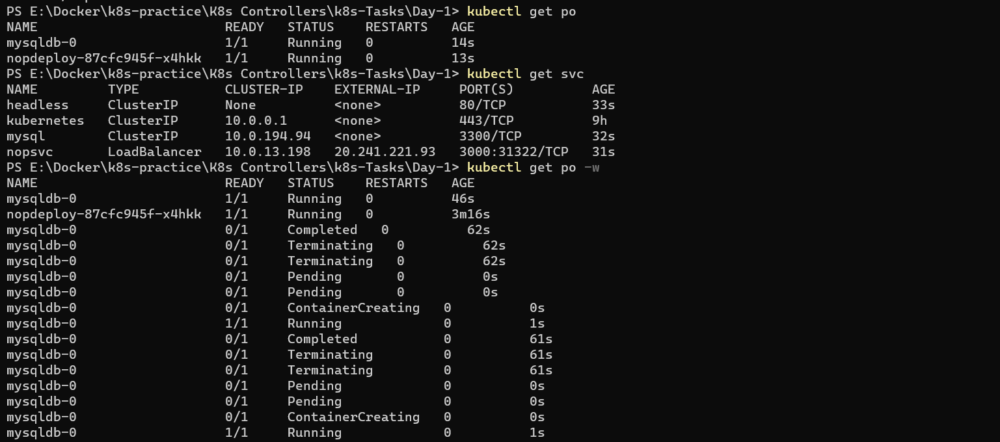

## Date:25/04/2023
## Kubernetes (K8s)
* The shortform of k8s is came from the charachters between the kubernetes of (K-s)
## Definition of kubernetes
* Kubernetes is a portable, extensible, open source platform for managing containerized workloads and services, that facilitates both declarative configuration and automation. It has a large, rapidly growing ecosystem. Kubernetes services, support, and tools are widely available.
* Kubernetes lets you create, deploy, manage, and scale application containers across one or more host clusters.
## Need for K8s
  ## High Availability (HA):
* When we run our applications in docker container and if the container fails, we need to manually start the container.
* If the node i.e. the machine fails all the containers running on the machine should be re-created on other machine.
* K8s can do both of the above.
## Autoscaling
* Containers don’t scale on their own.
* Scaling is of two types
   * Vertical Scaling
   * Horizontal Scaling
* K8s can do both horizontal and vertical scaling of containers
Zero-Down time Deployments
* K8s can handle deployments with near zero-down time deployments
* K8s can handle rollout (new version) and roll back (undo new version => previous version)
* K8s is described as `"Production grade Container management"`.
## Installation of Kubernetes(k8s)
*  Single Node Installations
    * minikube
    * kind
* On-prem installations
    * kube-admin
* k8s as a Service
    * AKS
    * EKS
    * GKE
* Clients
    * kubectl
    * any rest based client
## IMP-k8s terms
   * **Distributed System:**Also known as distributed computing and distributed databases, a distributed system is a collection of independent components located on different machines that share messages with each other in order to achieve common goals.
   * **Node:**A Node is a worker machine in Kubernetes and may be either a virtual or a physical machine, depending on the cluster. Each Node is managed by the control plane. A Node can have multiple pods, and the Kubernetes control plane automatically handles scheduling the pods across the Nodes in the cluster.
   * A node is a basic unit of a data structure, such as a linked list or tree data structure. Nodes contain data and also may link to other nodes. Links between nodes are often implemented by pointers.
   * **Cluster:**A Kubernetes cluster is a set of nodes that run containerized applications. Containerizing applications packages an app with its dependences and some necessary services. They are more lightweight and flexible than virtual machines.
   * **State:**There are three possible container states: Waiting , Running , and Terminated . To check the state of a Pod's containers, you can use kubectl describe pod <name-of-pod> . The output shows the state for each container within that Pod.
   * **Stateful Applications:**Stateful applications save data to persistent disk storage for use by the server, by clients, and by other applications. An example of a stateful application is a database or key-value store to which data is saved and retrieved by other applications.
   ***Stateless application:** A stateless application is one which depends on no persistent storage. The only thing your cluster is responsible for is the code, and other static content, being hosted on it. That's it, no changing databases, no writes and no left over files when the pod is deleted.
   * **Monolith:**A monolithic application is constructed as one unit which means it's composed all in one piece. The Monolithic application describes a one-tiered software application within which different components combined into one program from a single platform.
   * **Microservices:**A microservice is a software design pattern. It's something developers get excited about. They are related, but do not require each other. You can have a monolith deployed as a container, or you can have an unrestricted, non-containerized microservice.
   * **Desired State:**A desired state is defined by configuration files made up of manifests, which are JSON or YAML files that declare the type of application to run and how many replicas are required to run a healthy system. The cluster's desired state is defined with the Kubernetes API(application programming interface).
   * **Declarative vs Imperative:**Imperative configuration involves creating Kubernetes resources directly at the command line against a Kubernetes cluster. Declarative configuration defines resources within manifest files and then applies those definitions to the cluster.
   *** Pet Vs Cattle:**Servers in on-premises data centers are generally viewed as “pets”, whereas servers in the cloud are considered “cattle”. Pets are indispensable servers where you can make configuration changes should problems arise While, Cattle are servers that can be deleted and rebuilt from scratch in case of failures.
## Kube-admin Installation
* Initially k8s used docker as a main container platform and docker used to get special treatment, from k8s 1.24 special treatment is stopped.
* k8s is designed to run any container technology, for this k8s expects container technology to follow k8s interfaces.
* Before install kubernetes we need to install CRI-Dockerd refer here url@https://github.com/Mirantis/cri-dockerd it is only for k8s after 1.24 verions.
## Prerequisets:
* Create 2 or 3 virtual machines with minimum of 2vCPUS and 4GB RAM
* 
* Installation method (kubeadm) which is something we will be using in on-premises k8s.
* Install docker in all the nodes.
* ` curl -fsSL https://get.docker.com -o get-docker.sh`
* `sh get-docker.sh`
* `sudo usermod -aG docker ubuntu` exit and relogin
* 
* 
* Install CRI-DOCKER in all the nodes, run the commands as root user.
```bash
# Run these commands as root
###Install GO###
wget https://storage.googleapis.com/golang/getgo/installer_linux
chmod +x ./installer_linux
./installer_linux
source ~/.bash_profile

git clone https://github.com/Mirantis/cri-dockerd.git
cd cri-dockerd
mkdir bin
go build -o bin/cri-dockerd
mkdir -p /usr/local/bin
install -o root -g root -m 0755 bin/cri-dockerd /usr/local/bin/cri-dockerd
cp -a packaging/systemd/* /etc/systemd/system
sed -i -e 's,/usr/bin/cri-dockerd,/usr/local/bin/cri-dockerd,' /etc/systemd/system/cri-docker.service
systemctl daemon-reload
systemctl enable cri-docker.service
systemctl enable --now cri-docker.socket
```


* Refer here for commands to install kubeadm,kubctl,kubelet url@https://kubernetes.io/docs/setup/production-environment/tools/kubeadm/install-kubeadm/
* Run these commands as root user `sudo apt-get update
* sudo apt-get install -y apt-transport-https ca-certificates curl`
* `sudo curl -fsSLo /etc/apt/keyrings/kubernetes-archive-keyring.gpg https://packages.cloud.google.com/apt/doc/apt-key.gpg`
* `echo "deb [signed-by=/etc/apt/keyrings/kubernetes-archive-keyring.gpg] https://apt.kubernetes.io/ kubernetes-xenial main" | sudo tee /etc/apt/sources.list.d/kubernetes.list`
* `sudo apt-get update
sudo apt-get install -y kubelet kubeadm kubectl
sudo apt-mark hold kubelet kubeadm kubectl`

* To configure the master node we have to follow below commands and wherever we apply these commands that is considered to be as a master node of kubeadm `kubeadm --help`,`kubeadm init --help`
* To configure kubeadm we have to take network policy as flannel that is "10.244.0.0/16" refer here url@https://github.com/flannel-io/flannel"
* ` kubeadm init --pod-network-cidr "10.244.0.0/16" --cri-socket "unix:///var/run/cri-dockerd.sock"` output of after applying the command
* 
* 
* To configure we have to follow above commands as regular user so you can exit as root user.
* To setup configure run this command to install flannel `kubectl apply -f https://github.com/flannel-io/flannel/releases/latest/download/kube-flannel.yml`
* 
* To attache the nodes to the master run this command by providing CRI-DOCKER in node as a root user `kubeadm join 172.31.85.229:6443 --token bq3k8r.gq6fdcgdaa3oqelt \
        --cri-socket "unix:///var/run/cri-dockerd.sock" \
        --discovery-token-ca-cert-hash sha256:659c7d1ad0262f54bcaa2be1610b251cc064345236d8342a39c3eae0e2ef1617`

* In master node run `kubectl get nodes -w`
* 
## Kubernetes Objects
* Every thing in k8s is an object.
* Every object has a spec and status
* spec: specification (what we have asked)
* status: (what was created)
## Resources in manifest
* To define a resource in a manifest file we create a yaml file with following structure
  * apiVersion: 
  * kind:
  * metadata:
  * spec:
## Kubernetes Objects
* Kubernetes objects are persistent entities in the Kubernetes system. Kubernetes uses these entities to represent the state of your cluster. Specifically, they can describe:
  * What containerized applications are running (and on which nodes)
  * The resources available to those applications
  * The policies around how those applications behave, such as restart policies, upgrades, and fault-tolerance
* A Kubernetes object is a "record of intent"--once you create the object, the Kubernetes system will constantly work to ensure that object exists. By creating an object, you're effectively telling the Kubernetes system what you want your cluster's workload to look like; this is your cluster's desired state.
## Kubernetes API
* The REST API is the fundamental fabric of Kubernetes. All operations and communications between components, and external user commands are REST API calls that the API Server handles. Consequently, everything in the Kubernetes platform is treated as an API object and has a corresponding entry in the API.
* The core of Kubernetes' control plane is the API server. The API server exposes an HTTP API that lets end users, different parts of your cluster, and external components communicate with one another.
* The Kubernetes API lets you query and manipulate the state of API objects in Kubernetes (for example: Pods, Namespaces, ConfigMaps, and Events).By default, the Kubernetes API server listens on port 6443 on the first non-localhost network interface, protected by TLS.
* Controlling Access to the Kubernetes API

## Pods
* Pods are the smallest deployable units of computing that you can create and manage in Kubernetes.
* A Pod (as in a pod of whales or pea pod) is a group of one or more containers, with shared storage and network resources, and a specification for how to run the containers.
* To create a pod use below commands
  ```
  kubectl apply -f
  kubectl get <api-resource>
  kubectl describe <kind> <name>
  ```
*  To view the complete manifest created by k8s `kubectl get <kind> <name> -o yaml`
## Pod lifecycle
* K8s Pods will have following states
  * **Pending:** The Pod has been accepted by the Kubernetes cluster, but one or more of the containers has not been set up and made ready to run. This includes time a Pod spends waiting to be scheduled as well as the time spent downloading container images over the network.
  * **Running:** The Pod has been bound to a node, and all of the containers have been created. At least one container is still running, or is in the process of starting or restarting.
  * **Succeded:** All containers in the Pod have terminated in success, and will not be restarted.
  * **Failed:** All containers in the Pod have terminated, and at least one container has terminated in failure. That is, the container either exited with non-zero status or was terminated by the system.
  * **Unknown:** For some reason the state of the Pod could not be obtained. This phase typically occurs due to an error in communicating with the node where the Pod should be running.
## Container States in k8s pod
  * **Waiting:** If a container is not in either the Running or Terminated state, it is Waiting. A container in the Waiting state is still running the operations it requires in order to complete start up: for example, pulling the container image from a container image registry, or applying Secret data. When you use kubectl to query a Pod with a container that is Waiting, you also see a Reason field to summarize why the container is in that state.
  * **Running:** The Running status indicates that a container is executing without issues. If there was a postStart hook configured, it has already executed and finished. When you use kubectl to query a Pod with a container that is Running, you also see information about when the container entered the Running state.
  * **Terminated:**

## Date:26/04/2023

## Day-1 k8s tasks
## 1) Write a Pod Spec for Spring PetClinic and nopCommerce Applications
## Spring-petclinic
* First create kubernetes Pod spec or manifest.
```yaml
---
apiVersion: V1
kind: Pod
metadata:
  name: spc1-app
spec:
  containers:
    - name: spc
      image: manugatla/spring-petclinic
      ports:
        - containerPort: 8080
```
## Nopcommerce
* First create kubernetes Pod spec or manifest.
```yaml
---
apiVersion: V1
kind: Pod
metadata:
  name: nop-app
spec:
  containers:
    - name: spc
      image: manugatla/nopcommerce
      ports:
        - containerPort: 8080
```
## 2) Execute the kubectl commands:
## For Spring-petclinic
* To create a Pod we have to use command as `kubectl apply -f springpetclinic.yaml`
* To know the pod is created or not, run this command `kubectl get pods/po`
* To describe the Pod, run this command `kubectl describe pod spc1-app ==> <name of pod>`

## For Nopcommerce
* To create a Pod we have to use command as `kubectl apply -f nopcommerce.yaml`
* To know the pod is created or not, run this command `kubectl get pods/po`
* To describe the Pod, run this command `kubectl describe pod nop-app ==> <name of pod>`


## Date:27/04/2023

## Day-2 k8s tasks

# Explain Kubernetes architecture
* Kubernetes is an architecture that offers a loosely coupled mechanism for service discovery across a cluster. A Kubernetes cluster has one or more control planes, and one or more compute nodes.
* Environments running Kubernetes consist of the following key components:
* Control plane:It manges the k8s clusters and Workloads and it has componetns like API server,Schedular and control manger
  * API Server:It servers as front end for k8s to communicate with control plane componets and worker nodes and handling external and internal request.
  * Schedular:This component is responsible for scheduling pods on specific nodes according to automated workflows.
  * Control manger:The Kubernetes controller manager is a control loop that monitors and regulates the state of a Kubernetes cluster.
  * etcd:It is component in control plane which stores the data of cluster state and configuration.
  * cloud-controller-manager:This component can embed cloud-specific control logic - for example, it can access the cloud provider’s load balancer service.
* Worker nodes:
  * Nodes: Nodes are physical or virtual machines that can run pods as part of a Kubernetes cluster. A cluster can scale up to 5000 nodes. 
  * Pods: A pod serves as a single application instance, and is considered the smallest unit in the object model of Kubernetes.
  * kubelet: Each node contains a kubelet, which is a small application that can communicate with the Kubernetes control plane.
  * kube-proxy:It handles all network communications outside and inside the cluster, forwarding traffic or replying on the packet filtering layer of the operating system.

# Setup k8s on single node using minikube and kind
# Minikube Installation
* Requirements for installation of Minikube
  * 2 CPUs or more.
  * 2GB of free memory.
  * 20GB of free disk space.
  * Internet connection.
  * Container or virtual machine manager, such as: Docker
# Steps
* Install Docker 


* Install Minikube Refer here url@https://minikube.sigs.k8s.io/docs/start/ 
* Run below commands to install Minikube
* `curl -LO https://storage.googleapis.com/minikube/releases/latest/minikube-linux-amd64`
* `sudo install minikube-linux-amd64 /usr/local/bin/minikube`
* Start your cluster use below command
* `minikube start`

* To Interact with your cluster use below commands
* If you already have kubectl installed, you can now use it to access your shiny new cluster use this command `kubectl get po -A`
* If not use `minikube kubectl -- get po -A` to easy way of using this command you need to use `alias kubectl="minikube kubectl --"`

* some services such as the storage-provisioner, may not yet be in a Running state. This is a normal condition during cluster bring-up, and will resolve itself momentarily. For additional insight into your cluster state, minikube bundles the Kubernetes Dashboard, allowing you to get easily acclimated to your new environment:
* `minikube dashboard` to exit from Dashboard use `CTRL+C`
* To Deploy applications
* Create a Spring-petclinic application deployment and expose it on port 8080.
* `kubectl create deployment spc-minikube --image=manugatla/spring-petclinic`
* `kubectl expose deployment spc-minikube --type=NodePort --port=8080`
* `kubectl get services spc-minikube`
* To Port forwarding use command `kubectl port-forward --address "0.0.0.0" service/spc-minikube 7081:8080` then to access application ` http://localhost:7081/.` localhost => Public ip


# Kind Installation
* Requirements for installation of Minikube
  * 2 CPUs or more.
  * 2GB of free memory.
  * 20GB of free disk space.
  * Internet connection.
  * Container or virtual machine manager, such as: Docker
  * 6GB of RAM dedicated to the virtual machine (VM) running the Docker engine. 
# Steps
* Install Docker 
* To install kind on linux ubuntu use below commands and refer here for more details url@https://kind.sigs.k8s.io/docs/user/quick-start/
* `curl -Lo ./kind https://kind.sigs.k8s.io/dl/v0.18.0/kind-linux-amd64`
* `chmod +x ./kind`
* `sudo mv ./kind /usr/local/bin/kind`

* To create cluster in Kind use `kind create cluster`

* To create Pods in kind use below commands
* First create a manifest file then apply commands 
```yaml
apiVersion: v1
kind: Pod
metadata:
  name: spc-app
spec:
  containers:
    - name: spc
      image: manugatla/spring-petclinic:latest
      ports:
        - containerPort: 8080
```
* `kubectl apply -f <spc.yaml>
* To see the pods
* `kubect get pods`

* 
# Run the Spring Pet Clinic
# Deployed application in Minikube
* Create a Spring-petclinic application deployment and expose it on port 8080.
* `kubectl create deployment spc-minikube --image=manugatla/spring-petclinic`
* `kubectl expose deployment spc-minikube --type=NodePort --port=8080`
* `kubectl get services spc-minikube`
* To Port forwarding use command `kubectl port-forward --address "0.0.0.0" service/spc-minikube 7081:8080` 
* To access application` http://localhost:7081/.` localhost => Public ip


## Date:28/04/2023

## Day-3 k8s activities

## K8s manifest by using api-service "restartpolicy"
* The spec of a Pod has a restartPolicy field with possible values Always, OnFailure, and Never. The default value is Always.
* The restartPolicy applies to all containers in the Pod. restartPolicy only refers to restarts of the containers by the kubelet on the same node. After containers in a Pod exit, the kubelet restarts them with an exponential back-off delay (10s, 20s, 40s, …), that is capped at five minutes.
## Restart always
```yaml
apiVersion: v1
kind: Pod
metadata:
  name: always-restart
spec:
  restartPolicy: Always
  containers:
    - name: always
      image: manugatla/spring-petclinic
      ports:
        - containerPort: 8080
      command: ["sleep","10s"]
```
commands to execute
* `kubectl apply -f restartalways.yaml`
* To get pods use `kubectl get po -w`


## Restart Onfailure
```yaml
# Restart Onfailure code -failure
---
apiVersion: v1
kind: Pod
metadata:
  name: onfailure-restart
spec:
  restartPolicy: OnFailure
  containers:
    - name: failure
      image: manugatla/spring-petclinic
      ports:
        - containerPort: 8080
      command: ["sleep","1sm"]
```
commands to execute
* `kubectl apply -f restartonfailure.yaml`
* To get pods use `kubectl get po -w`

```yaml
# Restart Onfailure code -success
---
apiVersion: v1
kind: Pod
metadata:
  name: onfailure-restart-1
spec:
  restartPolicy: OnFailure
  containers: 
    - name: success
      image: manugatla/spring-petclinic
      ports:
        - containerPort: 8080
      command: ["sleep","10s"]
```
commands to execute
* `kubectl apply -f restartonfailure1.yaml`
* To get pods use `kubectl get po -w`

## Restart never
```yaml
---
apiVersion: v1
kind: Pod
metadata:
  name: never-restart
spec:
  restartPolicy: Never
  containers:
    - name: always
      image: manugatla/spring-petclinic
      ports:
        - containerPort: 8080
      command: ["sleep","10s"]
```
commands to execute
* `kubectl apply -f restartnever.yaml`
* To get pods use `kubectl get po -w`

## Jobs
* A Job creates one or more Pods and will continue to retry execution of the Pods until a specified number of them successfully terminate. As pods successfully complete, the Job tracks the successful completions.
```yaml
apiVersion: batch/v1
kind: Job
metadata:
  name: job-intro
spec:
  backoffLimit: 3
  template:
    metadata:
      name: spc
    spec:
      restartPolicy: Never
      containers:
        - name: alpine
          image: alpine
          ports:
            - containerPort: 8080
          command:
            - sleep
            - 10s
```
commands to execute
* `kubectl apply -f jobs.yaml`
* To get jobs use `kubectl get jobs -w`
* To get pods use `kubectl get po -w`

## Cronjob
* CronJob is meant for performing regular scheduled actions such as backups, report generation, and so on. 
```yaml
---
apiVersion: batch/v1
kind: CronJob
metadata: 
  name: cornjob
spec:
  schedule: '* * * * *'
  jobTemplate:
    metadata:
      name: create data
    spec:
      backoffLimit: 2
      template:
        metadata:
          name: to create containers
        spec:
          restartPolicy: OnFailure
          containers:
            - name: jenkins
              image: jenkins/jenkins:jdk11
              ports:
                - containerPort: 8080
              command: ["sleep","10s"]
            - name: nginx
              image: nginx:1.24
              ports:
                - containerPort: 80
              command: ["sleep","10s"]
```
commands to execute
* `kubectl apply -f cornjobs.yaml`
* To get cronjobs use `kubectl get cornjobs` or `kubectl get cornjobs.batch`

* To get pods use `kubectl get jobs -w`

## Replicaset
* A ReplicaSet's purpose is to maintain a stable set of replica Pods running at any given time. As such, it is often used to guarantee the availability of a specified number of identical Pods.
```yaml
---
apiVersion: apps/v1
kind: ReplicaSet
metadata:
  name: replicaset
spec:
  minReadySeconds: 1
  replicas: 3
  selector: 
    matchLabels:
      app: jenkins
  template:
    metadata:
      name: jenkins-pod
      labels:
        app: jenkins
    spec:
      restartPolicy: OnFailure
      containers:
        - name: jenkins
          image: jenkins/jenkins:jdk11
          ports:
            - containerPort: 8080
          command: ["sleep","5s"]
```
commands to execute
* `kubectl apply -f jenkins-rs.yaml`
* To get replicasets use `kubectl get rs -w`
* To get pods use `kubectl get po -w`


## Date:05/05/2023
* Create a MySQL pod with Stateful Set with 1 replica
```yaml
apiVersion: apps/v1
kind: StatefulSet
metadata:
  name: mysqldb
spec:
  minReadySeconds: 1
  serviceName: mysql
  replicas: 1
  selector:
    matchLabels:
      db: mysql
  template:
    metadata:
      name: mysqlpod
      labels:
        db: mysql
    spec:
      containers:
        - name: mysql
          image: mysql:8.0
          ports:
            - containerPort: 3306
          env:
            - name: MYSQL_ROOT_PASSWORD
              value: manuroot
            - name: MYSQL_USER
              value: gmanohar
            - name: MYSQL_PASSWORD
              value: manu1234
            - name: MYSQL_DATABASE
              value: students
          volumeMounts:
            - name: sqlvolume
              mountPath: /var/lib/mysql
      volumes:
        - name: sqlvolume
          emptyDir:
              sizeLimit: 100Mi
---
apiVersion: v1
kind: Service
metadata:
  name: mysql
spec:
  type: ClusterIP
  selector:
    db: mysql
  ports:
    - port: 3300
      protocol: TCP
      targetPort: 3306
```

* Create a nopCommerce deployment with 1 replica
```yaml
apiVersion: apps/v1
kind: Deployment
metadata:
  name: nopdeploy
  labels:
    app: nop
spec:
  minReadySeconds: 1
  replicas: 1
  selector:
    matchLabels:
      app: nop
  strategy:
    type: RollingUpdate
  template:
    metadata:
      name: noppod
      labels:
        app: nop
    spec:
      containers:
        - name: nopcommerce
          image: manugatla/nopcommerce
          ports:
            - containerPort: 5000
          env:
            - name: MYSQL_SERVER
              value: mysql
---
apiVersion: v1
kind: Service
metadata:
  name: nopsvc
spec:
  type: LoadBalancer
  selector:
    app: nop
  ports:
    - port: 3000
      protocol: TCP
      targetPort: 5000  
```

* Create a Headless Service to interact with nopCommerce with MySQL 
```yaml
apiVersion: v1
kind: Service
metadata:
  name: headless
spec:
  type: ClusterIP
  clusterIP: None 
  ports:
    - port: 80
      protocol: TCP
      targetPort: 5000
  selector:
    app: nop
    db: mysql
```
* Create a Load Balancer to expose the nopCommerce to External World
 
 
* Try to draw the Architecture Diagram for the above by using Draw.io Tool.


## Date: 09/05/2023
## 1.Create a Kubernetes cluster using kubeadm
* To install kubeadm cluster create `2 or 3 t2medium` EC2 instances in AWS cloud 
* Created shell script to install kubeadm
```bash
#!/bin/bash
apt-get update
curl -fsSL https://get.docker.com -o get-docker.sh
sh get-docker.sh
sudo usermod -aG docker ubuntu 
wget https://storage.googleapis.com/golang/getgo/installer_linux
chmod +x ./installer_linux
./installer_linux
source ~/.bash_profile
git clone https://github.com/Mirantis/cri-dockerd.git
cd cri-dockerd
mkdir bin
go build -o bin/cri-dockerd
mkdir -p /usr/local/bin
install -o root -g root -m 0755 bin/cri-dockerd /usr/local/bin/cri-dockerd
cp -a packaging/systemd/* /etc/systemd/system
sed -i -e 's,/usr/bin/cri-dockerd,/usr/local/bin/cri-dockerd,' /etc/systemd/system/cri-docker.service
systemctl daemon-reload
systemctl enable cri-docker.service
systemctl enable --now cri-docker.socket
cd ~
sudo apt-get update
sudo apt-get install -y apt-transport-https ca-certificates curl
sudo curl -fsSLo /etc/apt/keyrings/kubernetes-archive-keyring.gpg https://packages.cloud.google.com/apt/doc/apt-key.gpg
echo "deb [signed-by=/etc/apt/keyrings/kubernetes-archive-keyring.gpg] https://apt.kubernetes.io/ kubernetes-xenial main" | sudo tee /etc/apt/sources.list.d/kubernetes.list
sudo apt-get update
sudo apt-get install -y kubelet kubeadm kubectl
sudo apt-mark hold kubelet kubeadm kubectl
```
* EXit and Re-login into machine.
* To create cluster use command in master node `kubeadm init --pod-network-cidr "10.244.0.0/16" --cri-socket "unix:///var/run/cri-dockerd.sock"`
* 
* 
* To configure we have to follow above commands as regular user so you can exit as root user.
* To setup configure run this command to install flannel `kubectl apply -f https://github.com/flannel-io/flannel/releases/latest/download/kube-flannel.yml`
* 
* To attache the nodes to the master run this command by providing CRI-DOCKER in node as a root user `kubeadm join 172.31.85.229:6443 --token bq3k8r.gq6fdcgdaa3oqelt \
        --cri-socket "unix:///var/run/cri-dockerd.sock" \
        --discovery-token-ca-cert-hash sha256:659c7d1ad0262f54bcaa2be1610b251cc064345236d8342a39c3eae0e2ef1617`

* In master node run `kubectl get nodes -w`
* 

## 2.Deploy any application using kubectl
* Deployed Game-of-life by using Deployment in `microk8s cluster`
* Game-of-life yaml file
```yaml
apiVersion: apps/v1
kind: Deployment
metadata:
  name: game-of-life
spec:
  minReadySeconds: 1
  replicas: 3
  selector:
    matchLabels:
      app: gol
  strategy:
    type: RollingUpdate
    rollingUpdate:
      maxSurge: 25%
      maxUnavailable: 25%
  template:
    metadata:
      name: gol-pod
      labels:
        app: gol
    spec:
      containers:
        - name: gol-cont
          image: manugatla/gameoflife
          ports:
            - containerPort: 8080
---
apiVersion: v1
kind: Service
metadata: 
  name: gol-svc
spec:
  type: LoadBalancer
  selector:
    app: gol
  ports:
    - port: 8081
      protocol: TCP
      targetPort: 8080 
```
* To Create Deployement `microk8s kubectl apply -f gol.yaml

* To get the pods `microk8s kubectl get po -w`

## 3.Backup Kubernetes I.e backup etcd
## 4.List out all the pod’s running in kube system namespace
* To listout pods running in kube-system namespace
* `kubectl get pods --namespace=kube-system`

## 5.Write down all the steps required to make Kubernetes highly available
* For worker node high availability, you need to run multiple worker nodes that is required for your applications. When there is a pod scaling activity or a node failure there should be enough capacity on other worker nodes for the pods to get scheduled.
6.Do a rolling update and roll back.
7.Ensure usage of secret in MySQL and configmaps
## 8.Create a nop commerce deployment with MySQL statefulset and nop deployment
mysql-manifest file
```yaml
apiVersion: apps/v1
kind: StatefulSet
metadata:
  name: mysqldb
spec:
  minReadySeconds: 1
  serviceName: mysql
  replicas: 1
  selector:
    matchLabels:
      db: mysql
  template:
    metadata:
      name: mysqlpod
      labels:
        db: mysql
    spec:
      containers:
        - name: mysql
          image: mysql:8.0
          ports:
            - containerPort: 3306
          env:
            - name: MYSQL_ROOT_PASSWORD
              value: manuroot
            - name: MYSQL_USER
              value: gmanohar
            - name: MYSQL_PASSWORD 
              value: manu1234
            - name: MYSQL_DATABASE 
              value: students
          volumeMounts:
            - name: mysql-pvc
              mountPath: /var/lib/mysql
      volumes:
        - name: mysql-pvc
          persistentVolumeClaim:
            claimName: mysql-pvc1
            readOnly: false
  # volumeClaimTemplates:
  #   - metadata:
  #       name: sqlvolume
  #     spec:
  #       accessModes:
  #         - ReadWriteOnce
  #       selector:
  #         matchLabels:
  #           db: mysql
  #       storageClassName: managed
  #       resources:
  #         requests:
  #           storage: 1Gi      
---
apiVersion: v1
kind: Service
metadata:
  name: mysql
spec:
  type: ClusterIP
  selector:
    db: mysql
  ports:
    - port: 4500
      protocol: TCP
      targetPort: 3306
---
apiVersion: v1
kind: PersistentVolumeClaim
metadata:
  name: mysql-pvc1
spec:
  accessModes:
    - ReadWriteOnce
  storageClassName: managed
  resources:
    requests:
      storage: 1Gi
```